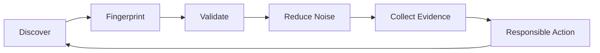

<div align="center">


<br />

<a href="https://fa1c0n.xyz">
  
</a>
<a href="https://internet-research.fa1c0n.xyz">
  
</a>
<a href="mailto:hello@fa1c0n.xyz">
  
</a>
<a href="https://www.linkedin.com/in/aayush-vishnoi">
  
</a>

<br />
<br />


</div>

---

## `whoami`

I am an independent security researcher focused on **API exposure**, **public attack surface intelligence**, and **automation-driven security research**.

My work sits at the intersection of exposed APIs, Swagger/OpenAPI documentation, public data leakage, shadow assets, and evidence-first security automation.

I care about finding **high-signal exposure** before it becomes attacker opportunity.

---

## Current Research Focus

<table>
  <tr>
    <td width="50%" valign="top">
      <h3>API & Schema Exposure</h3>
      <p>
        Exposed Swagger/OpenAPI surfaces, risky API documentation,
        unauthenticated routes, sensitive schemas, and leaked examples.
      </p>
    </td>
    <td width="50%" valign="top">
      <h3>Public Attack Surface</h3>
      <p>
        Forgotten assets, shadow infrastructure, internet-facing services,
        weak exposure patterns, and externally visible risk.
      </p>
    </td>
  </tr>
  <tr>
    <td width="50%" valign="top">
      <h3>Public Data Leakage</h3>
      <p>
        PII, secrets, internal metadata, public files, and operational details
        accidentally exposed across modern web systems.
      </p>
    </td>
    <td width="50%" valign="top">
      <h3>Security Automation</h3>
      <p>
        Repeatable workflows that collect evidence, reduce noise, track deltas,
        and support responsible manual validation.
      </p>
    </td>
  </tr>
</table>

---

## Featured Research Tool

<div align="center">


<br />
<br />

<table>
  <tr>
    <td align="left" width="820">

<pre>
● ● ●  https://internet-research.fa1c0n.xyz
</pre>

<div align="center">


</div>

<br />

<p align="center">
A defender-first utility to audit known <b>openapi.json</b> files or discover
<b>shadow API documentation</b> from a domain you may not even know is exposed.
</p>

<div align="center">

<a href="https://internet-research.fa1c0n.xyz">
  
</a>

</div>

<br />

```
</td>
```

  </tr>
</table>

<br />

<table>
  <tr>
    <td width="33%" valign="top">
      <h3>1. Direct Audit</h3>
      <p>
        Provide an <b>openapi.json</b> or Swagger URL and review exposed routes,
        sensitive schemas, examples, auth gaps, and risky API patterns.
      </p>
    </td>
    <td width="33%" valign="top">
      <h3>2. Shadow API Docs</h3>
      <p>
        Provide a domain and discover possible Swagger/OpenAPI documentation
        that may be publicly exposed but forgotten.
      </p>
    </td>
    <td width="33%" valign="top">
      <h3>3. Compliance Context</h3>
      <p>
        Map discovered PII, secrets, and sensitive exposure signals to
        <b>DPDP</b> and <b>ISO 27001</b> review context for Indian organizations.
      </p>
    </td>
  </tr>
</table>

<br />

<b>Built for research, validation, and defender-side API exposure review.</b>

</div>

---

## What I Build

```text
research pipelines    -> collect, normalize, fingerprint, validate
exposure scanners     -> detect public API, docs, and data leakage patterns
automation workflows  -> turn repetitive security checks into repeatable systems
evidence tooling      -> preserve context for reporting and remediation
defender utilities    -> help teams understand exposure safely
```

Most of my tooling follows one principle:

> **Useful security research should produce clear evidence, not just alerts.**

---

## Research Operating Loop



---

## Areas I Am Exploring

| Track                           | What I am looking at                                                          |
| ------------------------------- | ----------------------------------------------------------------------------- |
| **API Exposure**                | Swagger/OpenAPI leaks, unauthenticated routes, sensitive schema fields        |
| **Attack Surface Intelligence** | Domains, subdomains, services, TLS, DNS, and HTTP signals                     |
| **Data Leakage**                | PII exposure, public metadata, accidental internal information disclosure     |
| **Automation**                  | Recon workflows, delta detection, evidence-first validation                   |
| **AI-Era Security**             | AI endpoints, model gateways, RAG surfaces, prompt and tool exposure patterns |
| **Bug Bounty Research**         | High-signal leads for manual validation and responsible reporting             |

---

## Public Work Style

I prefer to keep my public work:

* research-first
* defender-friendly
* evidence-driven
* abuse-aware
* practical over noisy
* useful for security teams, researchers, and builders

I do not publish exploit-first material or unrestricted tooling that can create unnecessary harm.

---

## Philosophy

<div align="center">

<table>
  <tr>
    <td width="33%" align="center">
      <h3>See Clearly</h3>
      <p>Map what is exposed across the public internet.</p>
    </td>
    <td width="33%" align="center">
      <h3>Prove Carefully</h3>
      <p>Turn noisy findings into evidence that can be validated responsibly.</p>
    </td>
    <td width="33%" align="center">
      <h3>Act Earlier</h3>
      <p>Help defenders understand and reduce exposure before attackers use it.</p>
    </td>
  </tr>
</table>

<br />

<b>Security research should make the invisible parts of the internet easier to understand.</b>

</div>

---

## Connect

Open to discussing **API security**, **exposure research**, **security automation**, **responsible disclosure**, and defender-focused tooling.

<div align="center">

<a href="mailto:hello@fa1c0n.xyz">
  
</a>
<a href="https://internet-research.fa1c0n.xyz">
  
</a>

</div>

---

<div align="center">

### Find exposure before attackers find opportunity.

<br />


</div>
